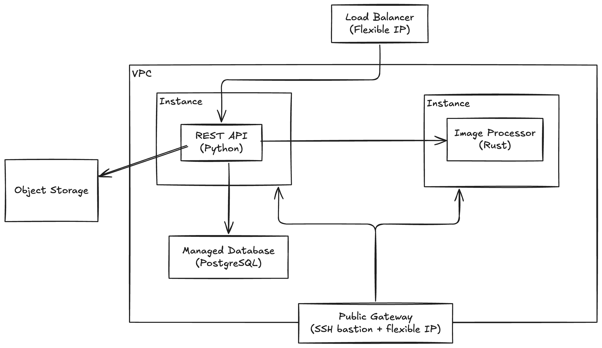

# Cloud-Native Image Converter on Scaleway

A PNG → JPEG conversion service deployed on [Scaleway](https://scaleway.com), built as a hands-on infrastructure and cloud learning project.

## What it does

Upload a PNG image, get back a JPEG stored in object storage. The converted image URL is persisted in a managed PostgreSQL database.

```bash
curl -F "file=@photo.png" http://<load-balancer-ip>/upload
# {"id":"77a55aeb-...","url":"https://<bucket>.s3.fr-par.scw.cloud/<id>.jpeg"}
```

## Architecture



| Component | Role |
|---|---|
| **Load Balancer** | Public HTTP entry point |
| **rest-api** (Python / FastAPI) | Receives uploads, delegates conversion, stores results |
| **image-processor** (Rust / actix-web) | Converts PNG → JPEG |
| **Object Storage** | Stores the converted JPEG files |
| **Managed PostgreSQL** | Stores image record URLs |
| **Secret Manager** | Holds sensitive credentials (DB URL, bucket name) |
| **VPC + Private Network** | All services communicate privately, no public IPs on instances |
| **Public Gateway** | NAT outbound traffic + SSH bastion for admin access |

### Security model

Instances have no public IP. Only the load balancer and the public gateway are internet-facing. Sensitive values (database URL, bucket name) are never injected as plain environment variables — the application fetches them from Secret Manager at startup.

## Tech stack

| Layer | Technology |
|---|---|
| REST API | Python 3.14, FastAPI, SQLAlchemy, boto3 |
| Image Processor | Rust, actix-web |
| Infrastructure | Terraform (Scaleway provider) |
| Storage | Scaleway Object Storage (S3-compatible) |
| Database | Scaleway Managed PostgreSQL 15 |
| Secrets | Scaleway Secret Manager |
| Networking | VPC, Private Network, Public Gateway |
| CI/CD | GitHub Actions, ghcr.io |

## Run locally

Copy `dot.env` to `.env` and fill in your Scaleway credentials, then:

```bash
cp dot.env .env
# edit .env with your values
docker compose up
```

Test:
```bash
curl -F "file=@logo.png" localhost:8080/upload
```

## Deploy on Scaleway

**Prerequisites**: Terraform, Docker with buildx, a Scaleway account with API keys.

```bash
# 1. Fill in your credentials
cp dot.env terraform/terraform.tfvars
# edit terraform/terraform.tfvars

# 2. Deploy infrastructure + push images
make init
make deploy

# 3. Test
curl -F "file=@logo.png" http://<load-balancer-ip>/upload
```

Run `make help` to see all available commands.

## CI/CD

GitHub Actions runs on every push and pull request:

- **Python lint** — `ruff check` on `rest-api/`
- **Docker build** — both `rest-api` and `image-processor` images
- **Trivy scan** — CRITICAL and HIGH CVEs, results visible in the Security tab

Images are published to `ghcr.io` on pushes to `main`.

## Challenges

The [`challenges/`](challenges/) directory is a dev journal documenting the implementation challenges tackled during this project:

| # | Challenge | What it covers |
|---|---|---|
| 1 | [Terraform](challenges/01-terraform.md) | Full infra as code: VPC, instances, managed DB, load balancer, security groups, placement groups, cloud-init |
| 2 | [Secret Manager](challenges/02-secret-manager.md) | Dynamic credential fetching at runtime — no plain env vars for sensitive values |

## License

[Apache 2.0](LICENSE)
